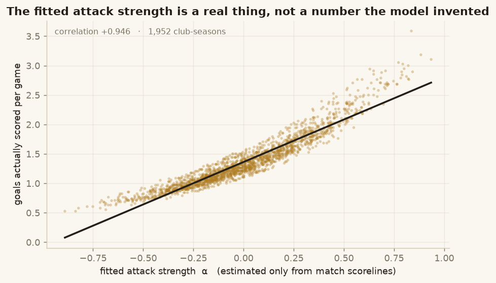
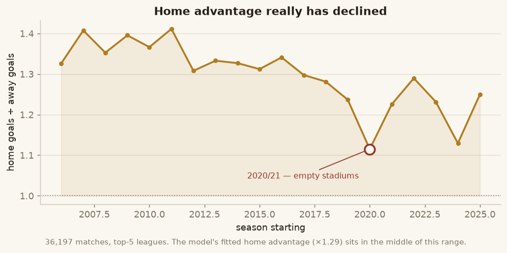
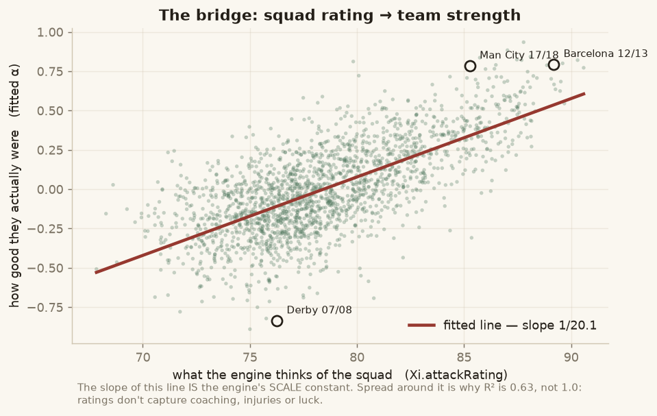
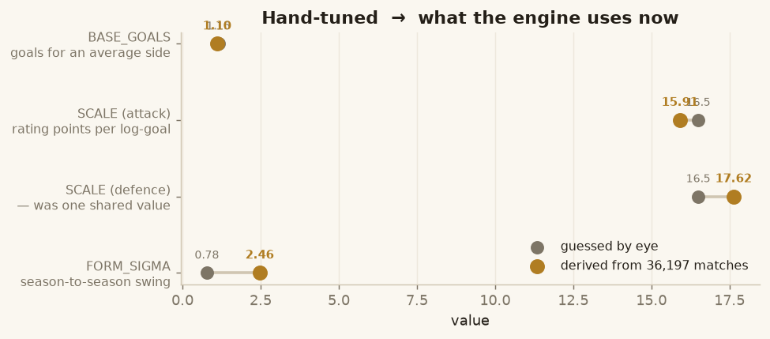
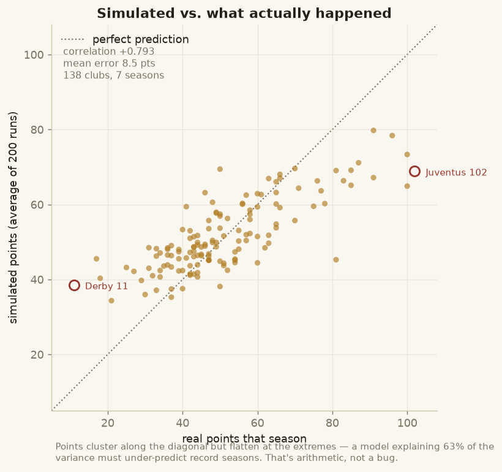
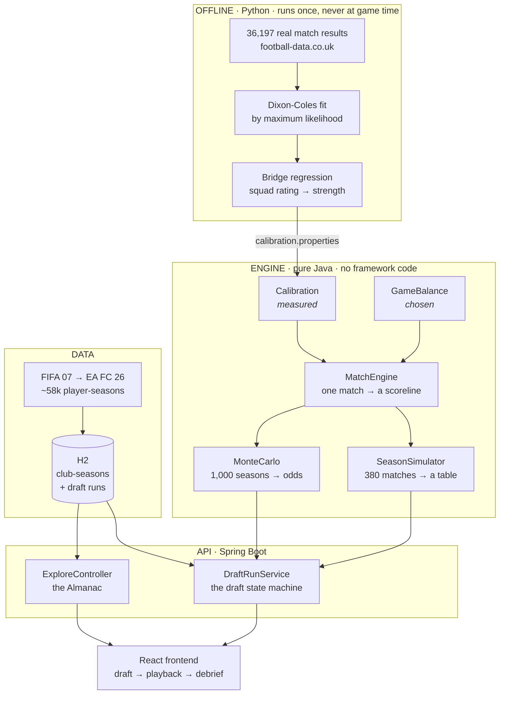

# footy-draft

**Spin for a tier. Pick a club. Steal one player. Repeat eleven times, then find out whether your patchwork side can survive a 38-game season.**

A football draft-and-simulation game built from scratch — every player who appeared in a top-5 European league between FIFA 07 and EA FC 26 is in the pool, so your XI can pair Kaká's 2007 with Haaland's 2025. The season that follows is simulated by a match engine whose constants were **fitted by maximum likelihood to 36,197 real matches**, not tuned by hand until they looked about right.

Spring Boot + a dependency-free Java engine, a React frontend, and an offline Python pipeline that does the statistics.

> Just want to run it? `mvn spring-boot:run`, then `cd frontend && npm run dev`. Full setup in [Quick start](#quick-start).

---

## Contents

| | |
|---|---|
| [What you actually do](#what-you-actually-do) | the game loop |
| [The interesting part: fitting it to real football](#the-interesting-part-fitting-it-to-real-football) | where the engine's numbers came from |
| [How it fits together](#how-it-fits-together) | architecture |
| [Quick start](#quick-start) | get it running |
| [Project layout](#project-layout) | where things live |
| [Running the analysis yourself](#running-the-analysis-yourself) | the Python pipeline |
| [Status](#status) | what works, what's next |

For the full detail — every model, every formula, every decision and why — see **[TECHNICAL.md](TECHNICAL.md)**. Open defects are tracked in **[docs/KNOWN_ISSUES.md](docs/KNOWN_ISSUES.md)**.

---

## What you actually do

```
  SPIN ──▶ a tier lands:  MINNOW · STEADY · PEDIGREE · ELITE · ICONIC
    │
    ▼
  CHOOSE ──▶ one of three real club-seasons at that tier
    │          (Liverpool 2018/19?  Sampdoria 2009/10?)
    ▼
  DRAFT ──▶ take exactly ONE player from that squad into an open position
    │
    └──▶ ×11 until your XI is complete
              │
              ▼
        38-GAME SEASON against 19 other real club-seasons
              │
              ▼
        watch it unfold matchday by matchday, then read the debrief
```

The tension is that you never get to pick freely. The spin decides how strong a squad you're offered, the formation decides which positions you still need, and a club you've already raided never comes back. A great striker is worthless on a turn where you only have a left-back slot open.

A few things that make it more than a random-number generator:

- **Scout mode** — exact ratings are hidden. You see a smudged confidence band instead, so you're judging players on reputation and position, the way a scout would.
- **Prime mode** — draft players at their career-best season rather than the one you spun.
- **Real odds** — before kickoff the game simulates your exact season a thousand times and shows you the distribution. Afterwards it tells you where your actual season landed in it, so "I overperformed" is a percentile, not a feeling.
- **Call it** — during playback the game pauses at genuine moments (a summit clash, the unbeaten run on the line, a final-day decider) and asks you to predict the result. It's already decided; the question is whether you can read your own team.
- **The Almanac** — browse every top-5 squad from 2006/07 to 2025/26 and see the best XI the engine would field for them.

---


## The interesting part: fitting it to real football

A match simulator needs to answer one question: **given these two teams, how many goals?** Everything else is bookkeeping.

The usual approach is to invent a formula, add some constants, and nudge them until the output looks plausible. That's how this started — six numbers, tuned by running a simulation and squinting at it. It worked, in the sense that nothing looked obviously wrong. But there was no way to know whether the numbers were *right*, and no way to tell whether two wrong values were quietly cancelling out.

So they got measured instead.

### Step 1 — get 36,197 real matches

Every top-5 league result from 2006/07 to 2025/26, which is exactly the span the player data covers. One script, about a minute.

### Step 2 — work out how good each real team actually was

This is the statistics. For every one of 100 league-seasons, we fit a **Dixon-Coles model** — the standard model for football scorelines — which gives each team two numbers: an **attack strength** and a **defence strength**, chosen so they best explain that team's real results.

"Best explain" has a precise meaning. For any set of numbers you propose, you can compute how *likely* the real season was under them: Arsenal beat Spurs 3–1, what probability does this model assign to exactly 3–1? Multiply that across every match and you get one score for the whole set. **Maximum likelihood estimation** is just searching for the set that scores highest. A computer does the searching.

These strengths aren't an abstraction — they track reality closely:



### Step 3 — the validation nobody asked for

Before trusting any of it, a check: home advantage is known to have declined in real football over the last two decades. If the data shows that unprompted, the pipeline is probably sound.



It does — and the sharpest dip is 2020/21, the season played in empty stadiums. Nobody told the model about COVID.

### Step 4 — connect it to the game

Now the bridge. We know how good each real team *was*. We also know what the engine *thinks* of that same squad, because those clubs are in the player data. Plot one against the other, fit a line, and the slope of that line **is** the engine's scale constant.



No more guessing how an 85-rated squad converts into goals. It's measured across 1,952 club-seasons.

The result, with the old hand-tuned values for comparison:



The one that barely moved is a small vindication of the original guesswork; the two that moved a lot were genuinely wrong.

### Step 5 — does it actually work?

The honest test is not "does the simulation look plausible" but "does it reproduce seasons that really happened".

So: take a real league-season — say Serie A 2013/14 — find those exact twenty clubs in the player data, field each one's best XI, and simulate that league 200 times. Then compare to the table that actually happened. Seven league-seasons, 138 clubs.



**Correlation +0.79**, and match-level behaviour lands within a whisker of reality: 24.5% draws against a real 25.5%, 2.69 goals per game against 2.72. Simulated champions finish on 84–91 points against a real 81–102.

**The dots sit below the diagonal at the extremes, and that's easy to misread.** Juventus's record 102-point season shows a dot at 75 — but that dot is the *average of 200 simulated seasons*, while the x-axis is *one* real season. An average is always less extreme than a single draw, so comparing them manufactures the appearance of under-prediction.

The bars are the fair comparison: the range of seasons the engine actually produces. **88% of real results land inside them.** Play the game and you'll see 85- and 90-point champions regularly — the engine produces those seasons, it just doesn't *average* to them.

What remains underneath is a real limit: squad ratings explain 63% of the variation in team strength, so the model's averages stay somewhat compressed no matter what. Getting that far took one non-obvious correction — a regression predicts *means*, which carry only √R² of the real spread, and left uncorrected that made every team look more alike than real teams are. [TECHNICAL.md](TECHNICAL.md) has the workings and the numbers.

**Two things this bought beyond accuracy.** It found a real flaw in the original model — attack and defence turn out to respond to squad quality at genuinely different rates, which a single shared constant cannot express. And it forced a separation that should probably exist in any simulation game: measured values live in one file that is never hand-edited, and deliberate design choices live in another. When the game runs calmer than real football, that's now a documented decision with a number attached, rather than a quietly falsified measurement.

---

## How it fits together



The engine deliberately has **no Spring imports**. It's plain Java that can be compiled with `javac` and run on its own, which keeps it testable and keeps the simulation honest about what it depends on.

---

## Quick start

You need **Java 17+** and **Maven**. The player data (`*.csv`) is git-ignored — the app boots fine without it, just with an empty pool, so drop your FIFA exports into `data/` first.

```bash
mvn spring-boot:run          # API on http://localhost:8080
```

Then in another terminal:

```bash
# a whole season, no draft required
curl "localhost:8080/api/season/demo?overall=90&formation=4-3-3&seed=42"

# or play a full run end-to-end and check every step
python3 scripts/smoke_test.py
```

For the actual game, run the frontend too:

```bash
cd frontend && npm install && npm run dev     # http://localhost:5173
```

There's also a no-Maven path for the engine alone, which is handy when you only want to watch the simulation work:

```bash
javac -d out src/main/java/com/draft/footy/*.java
java -cp out com.draft.footy.Demo
```

---

---

## Project layout

```
src/main/java/com/draft/footy/
├── Calibration.java          constants MEASURED from real matches
├── GameBalance.java          values deliberately CHOSEN for playability
├── MatchEngine.java          one match → a scoreline (Dixon-Coles)
├── SeasonSimulator.java      38 matchdays, stats, awards
├── MonteCarlo.java           1,000 seasons → genuine odds
├── ClubSeason.java / Xi.java a club, and the best XI it can field
├── FifaDataLoader.java       CSV → club-seasons, across 20 editions
├── HistoricalValidation.java does the engine reproduce real seasons?
├── Demo.java                 runnable proof + calibration sweep
├── api/                      Spring layer: draft state machine, Almanac
└── persistence/              JPA entities, H2 seeding

analysis/calibration/         the offline Python pipeline (see below)
frontend/                     React + Vite + Tailwind
scripts/smoke_test.py         plays a full run against a live server
docs/images/                  figures, generated from real data
data/                         player CSVs + historical results (git-ignored)
```

---

## Running the analysis yourself

The Python side never runs during the game. It produces one file — `src/main/resources/calibration.properties` — which Java reads at startup.

```bash
python3 -m venv analysis/calibration/.venv
analysis/calibration/.venv/bin/pip install -r analysis/calibration/requirements.txt
V=analysis/calibration/.venv/bin/python

python3 analysis/calibration/fetch_results.py          # ~1 min, 100 files
mvn -q compile && java -cp target/classes com.draft.footy.ClubSeasonExport
python3 analysis/calibration/join_clubs.py             # → 99.9% matched
$V analysis/calibration/fit_dixon_coles.py             # ~16s, the MLE
$V analysis/calibration/fit_engine_constants.py        # → calibration.properties
$V analysis/calibration/make_plots.py                  # → docs/images/

java -cp target/classes com.draft.footy.HistoricalValidation   # does it hold up?
```

Each script explains itself if you read the top of the file, and prints its own sanity checks as it goes.

---

## Status

**Working end to end.** Draft, simulate, watch it play out, read the debrief. Browse the Almanac.

| | |
|---|---|
| Player pool | 1,952 club-seasons · 20 editions · ~58k player-seasons |
| Calibrated on | 36,197 real matches, 100 league-seasons |
| Validated against | 7 real league-seasons, 138 clubs — correlation +0.79 |
| Tests | 35 passing, plus an end-to-end smoke test against a live server |

**Next up:**

- **Cross-era chemistry** — links between players who shared a club, a nation, or an era, so the best pick depends on the ten you already have rather than always being the highest number available.
- **Persistent saved runs** — the database is in-memory, so runs vanish on restart.
- **A shareable front page** — the debrief as an exportable broadsheet.

Longer term, the calibration work opens two doors: a **drafting agent** trained by self-play against the simulator, and a proper **held-out evaluation** of the match model against bookmaker odds.

---

## Notes

Personal and educational. The 38-0 concept is the inspiration; the code, model and interface are original. Player data comes from public FIFA/sofifa exports and is not redistributed here — match results are from [football-data.co.uk](https://www.football-data.co.uk/).
