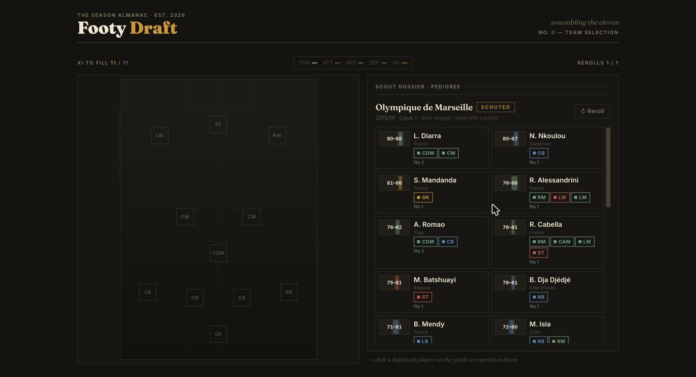
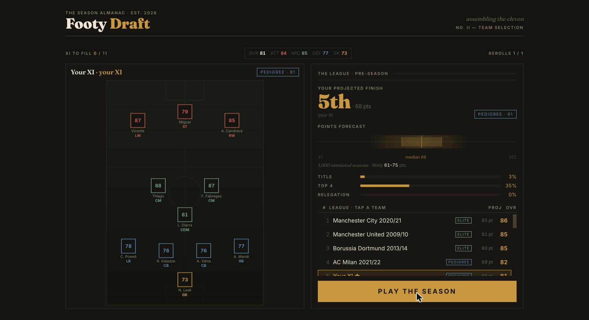
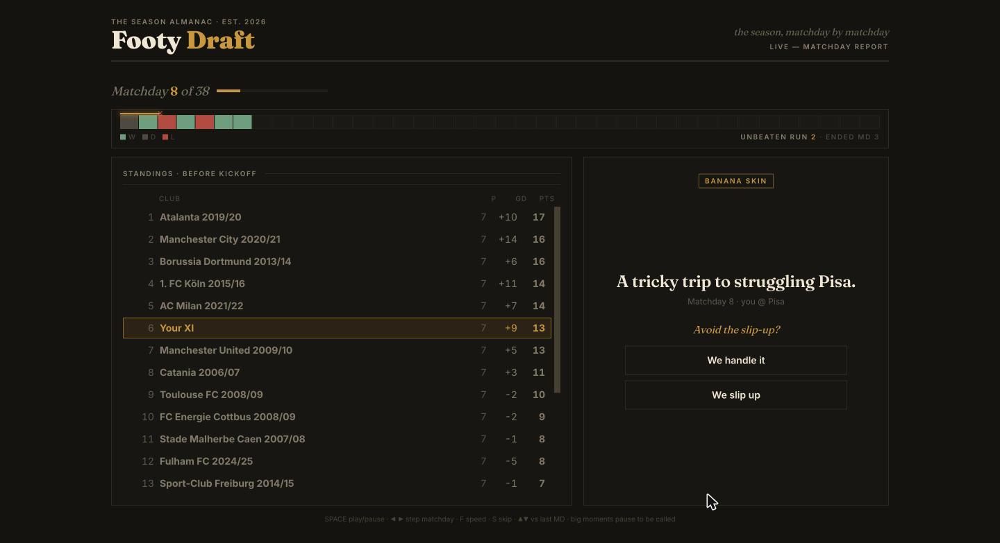
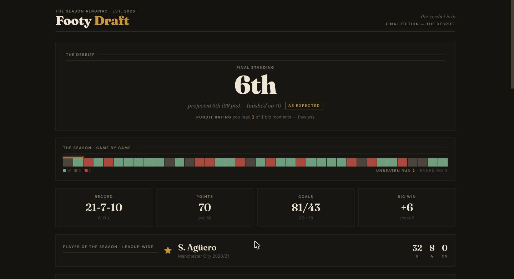
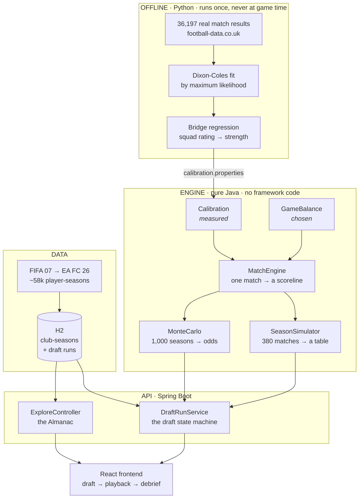

# footy-draft

Spin for a tier, pick one of three real club-seasons, take a single player from it. Do that eleven times and you have an XI. Then it plays a 38-game season and you find out how bad your decisions were.

Every player from a top-5 European league between FIFA 07 and EA FC 26 is in the pool, so you can end up with Kaká's 2007 alongside Haaland's 2025. The season is run by a match engine whose constants were fitted by maximum likelihood to 36,197 real matches rather than tuned by hand.

Spring Boot backend with a dependency-free Java engine, React frontend, and an offline Python pipeline for the statistics.

> Just want to run it? `mvn spring-boot:run`, then `cd frontend && npm run dev`. Full setup in [Quick start](#quick-start).

---

## Contents

| | |
|---|---|
| [What you actually do](#what-you-actually-do) | the game loop |
| [The interesting part: fitting it to real football](#the-interesting-part-fitting-it-to-real-football) | where the engine's numbers came from |
| [How it fits together](#how-it-fits-together) | architecture |
| [Quick start](#quick-start) | get it running |
| [Project layout](#project-layout) | where things live |
| [Running the analysis yourself](#running-the-analysis-yourself) | the Python pipeline |
| [Status](#status) | what works, what's next |

[TECHNICAL.md](TECHNICAL.md) has the full detail on every model and decision. Open defects are in [docs/KNOWN_ISSUES.md](docs/KNOWN_ISSUES.md).

---

## What you actually do

```
  SPIN ──▶ a tier lands:  MINNOW · STEADY · PEDIGREE · ELITE · ICONIC
    │
    ▼
  CHOOSE ──▶ one of three real club-seasons at that tier
    │          (Liverpool 2018/19?  Sampdoria 2009/10?)
    ▼
  DRAFT ──▶ take exactly ONE player from that squad into an open position
    │
    └──▶ ×11 until your XI is complete
              │
              ▼
        38-GAME SEASON against 19 other real club-seasons
              │
              ▼
        watch it unfold matchday by matchday, then read the debrief
```

The constraint is that you never get to pick freely: the spin decides how strong a squad you're offered, your formation decides which positions are still open, and once you've raided a club it won't come back. A great striker is no use on a turn where the only gap left is at left-back.

### 1. Drafting with the ratings hidden

By default you don't see exact ratings. You get a range instead (`80–88`, `76–81`), plus nationality and the positions a player can fill, so you're going off reputation and shape rather than sorting by a number.



After you pick, the rest of that squad is revealed so you can see who you passed on.

### 2. Odds before a ball is kicked

Once the XI is full, the game simulates your exact season a thousand times and reads the odds off the distribution. It's the same engine that's about to play the real one, so the projection and the result can't disagree.



Every other team gets the same treatment, so you can click any of the nineteen and see their squad and their forecast.

### 3. Playback, and calling the big moments

The season runs matchday by matchday with the table reordering as it goes. At certain points it stops and asks you to predict what happens next: a top-of-the-table game, an away trip you're expected to win, the unbeaten run on the line.



The result is already fixed by the simulation, so it's really a test of whether you can read your own team. The ribbon at the top is the season spine: one block per result, with an unbeaten run drawn as a gold thread that frays when it ends.

### 4. The debrief



Over- and under-performance is a percentile rather than a judgement call. Finishing on 70 when the projection said 68 tells you where that season landed among the thousand the engine already simulated.

### Also in there

- **Prime mode** — draft players at their career-best season instead of the one you spun. Better players, but your XI ends up spread across more eras.
- **The Almanac** — browse every top-5 squad from 2006/07 to 2025/26 and see the best XI the engine would field for each.

---

## The interesting part: fitting it to real football

A match simulator really only has to answer one question — given these two teams, how many goals — and most of the rest is bookkeeping.

The usual way to do that is to invent a formula, add some constants, and adjust them until the output looks about right. That's how this started, with six numbers tuned by running a simulation and eyeballing it. Nothing looked obviously broken, but there was no way to tell whether the numbers were right, or whether two wrong values were quietly cancelling out. Measuring them against real results turned out to be tractable, and that's what the rest of this section covers.

### Step 1 — get 36,197 real matches

Every top-5 league result from 2006/07 to 2025/26, which is the same span the player data covers. One script pulls the lot down in about a minute.

### Step 2 — work out how good each real team actually was

For each of 100 league-seasons, fit a **Dixon-Coles model** (the standard model for football scorelines). It gives every team two numbers, an attack strength and a defence strength, picked so they best explain that team's real results.

"Best explain" has a specific meaning here. Given any set of numbers you can work out how likely the real season was under them: Arsenal beat Spurs 3–1, what probability does the model give that exact score? Do that for every match and combine, and you get a single score for the whole set. Maximum likelihood estimation is just the search for the set that scores highest, and a computer does the searching.

The strengths that come out line up with reality:


### Step 3 — a check before trusting any of it

Home advantage has declined in real football over the last twenty years, which makes it a useful thing to check against. It turns up in the fitted data without anyone asking for it, including a sharp drop in 2020/21 when games were played in empty stadiums.


### Step 4 — connect it to the game

The bridge between the two is fairly direct. The fit says how good each real team was, and the engine has its own opinion of that same squad because those clubs are in the player data, so plotting one against the other and fitting a line gives the engine's scale constant as the slope.


That gives a measured answer to how an 85-rated squad turns into goals, across 1,952 club-seasons, instead of a guessed one.

Here's where the constants ended up against the old hand-tuned ones:


`BASE_GOALS` barely shifted, so the original guess there was close enough; the two scales moved a long way, which means they had been wrong.

### Step 5 — does it actually work?

A simulation looking plausible doesn't tell you much on its own, so the test that counts is whether it reproduces seasons that really happened. The setup is to take a real league-season — Serie A 2013/14, say — find those twenty clubs in the player data, field each one's best XI, simulate the league 200 times, and compare against the table that actually happened. Seven league-seasons in total, 138 clubs.


Correlation is **+0.79**, and the match-level numbers land close to reality: 24.6% draws against a real 25.5%, 2.69 goals per game against 2.72. Simulated champions finish on 78–91 points where the real ones finished on 81–102 (the low end of both is the Bundesliga, which plays 34 games rather than 38).

The dots sitting below the diagonal at the extremes are easy to misread. Juventus's record 102-point season shows a dot at 75, but that dot is the average of 200 simulated seasons while the x-axis is one real season. An average is always less extreme than a single result, so comparing the two makes it look like the model is under-predicting when it isn't.

The bars are the fair comparison, since they show the range of seasons the engine actually produces. 88% of real results land inside them. Play the game and 85- and 90-point champions turn up regularly; the engine produces those seasons, it just doesn't average to them.

Those seven seasons are inside the data the constants were fitted on, so that's an obvious thing to be suspicious of. Holding them out and refitting moves the correlation and the mean error by nothing at all, which makes sense: six global parameters fitted on 36,197 matches have nowhere to hide seven seasons. The numbers are in [TECHNICAL.md](TECHNICAL.md).

There is a real limit underneath all that: squad ratings only explain 63% of the variation in team strength, so the model's averages stay somewhat compressed. Getting that far needed one correction that wasn't obvious, since a regression predicts means and means carry only √R² of the real spread, which left every team looking more alike than real teams are. [TECHNICAL.md](TECHNICAL.md) has the working.

Accuracy aside, the exercise turned up a couple of unexpected things. It exposed a flaw in the original model, because attack and defence respond to squad quality at noticeably different rates and one shared constant can't express that. It also forced a split that probably belongs in any simulation game, where measured values live in a file that never gets hand-edited and deliberate design choices live in a separate one. So when the game runs calmer than real football, that's a decision with a number attached to it, not a constant quietly bent to suit.

---

## How it fits together



The engine has no Spring imports. It's plain Java you can compile with `javac` and run on its own, which keeps it easy to test and honest about its dependencies.

---

## Quick start

You need Java 17+ and Maven. The player CSVs are git-ignored, and the app boots fine without them (just with an empty pool), so put your FIFA exports in `data/` first.

```bash
mvn spring-boot:run          # API on http://localhost:8080
```

Then in another terminal:

```bash
# a whole season, no draft required
curl "localhost:8080/api/season/demo?overall=90&formation=4-3-3&seed=42"

# or play a full run end-to-end and check every step
python3 scripts/smoke_test.py
```

For the game itself you also need the frontend:

```bash
cd frontend && npm install && npm run dev     # http://localhost:5173
```

There's a no-Maven path for the engine on its own, useful if you just want to watch the simulation run:

```bash
javac -d out src/main/java/com/draft/footy/*.java
java -cp out com.draft.footy.Demo
```

---

---

## Project layout

```
src/main/java/com/draft/footy/
├── Calibration.java          constants MEASURED from real matches
├── GameBalance.java          values deliberately CHOSEN for playability
├── MatchEngine.java          one match → a scoreline (Dixon-Coles)
├── SeasonSimulator.java      38 matchdays, stats, awards
├── MonteCarlo.java           1,000 seasons → genuine odds
├── ClubSeason.java / Xi.java a club, and the best XI it can field
├── FifaDataLoader.java       CSV → club-seasons, across 20 editions
├── HistoricalValidation.java does the engine reproduce real seasons?
├── Demo.java                 runnable proof + calibration sweep
├── api/                      Spring layer: draft state machine, Almanac
└── persistence/              JPA entities, H2 seeding

analysis/calibration/         the offline Python pipeline (see below)
frontend/                     React + Vite + Tailwind
scripts/smoke_test.py         plays a full run against a live server
docs/images/                  figures, generated from real data
data/                         player CSVs + historical results (git-ignored)
```

---

## Running the analysis yourself

None of this runs during the game. It produces one file, `src/main/resources/calibration.properties`, which Java reads at startup.

```bash
python3 -m venv analysis/calibration/.venv
analysis/calibration/.venv/bin/pip install -r analysis/calibration/requirements.txt
V=analysis/calibration/.venv/bin/python

python3 analysis/calibration/fetch_results.py          # ~1 min, 100 files
mvn -q compile && java -cp target/classes com.draft.footy.ClubSeasonExport
python3 analysis/calibration/join_clubs.py             # → 99.9% matched
$V analysis/calibration/fit_dixon_coles.py             # ~16s, the MLE
$V analysis/calibration/fit_engine_constants.py        # → calibration.properties
$V analysis/calibration/make_plots.py                  # → docs/images/

java -cp target/classes com.draft.footy.HistoricalValidation   # does it hold up?
```

Each script has an explanation at the top of the file and prints its own sanity checks as it runs.

---

## Status

Working end to end: draft, simulate, watch it play out, read the debrief, browse the Almanac.

| | |
|---|---|
| Player pool | 1,952 club-seasons · 20 editions · ~58k player-seasons |
| Calibrated on | 36,197 real matches, 100 league-seasons |
| Validated against | 7 real league-seasons, 138 clubs — correlation +0.79 |
| Tests | 35 passing, plus an end-to-end smoke test against a live server |

**Next up:**

- **Cross-era chemistry** — links between players who shared a club, a nation, or an era, so the best pick depends on the ten you already have rather than always being the highest number available.
- **Persistent saved runs** — the database is in-memory, so runs vanish on restart.
- **A shareable front page** — the debrief as an exportable broadsheet.

Longer term, the calibration work opens two doors: a **drafting agent** trained by self-play against the simulator, and a proper **held-out evaluation** of the match model against bookmaker odds.

---

## Notes

Personal and educational project. The 38-0 concept is the inspiration; the code, model and interface are original. Player data comes from public FIFA/sofifa exports and isn't redistributed here. Match results are from [football-data.co.uk](https://www.football-data.co.uk/).
