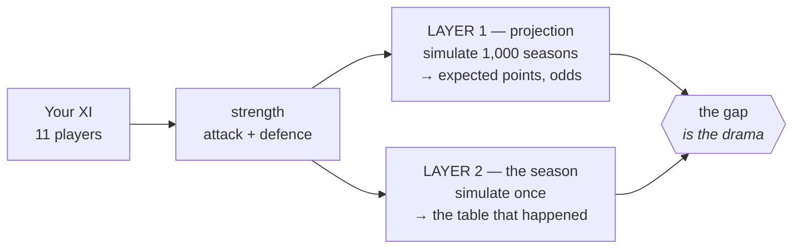
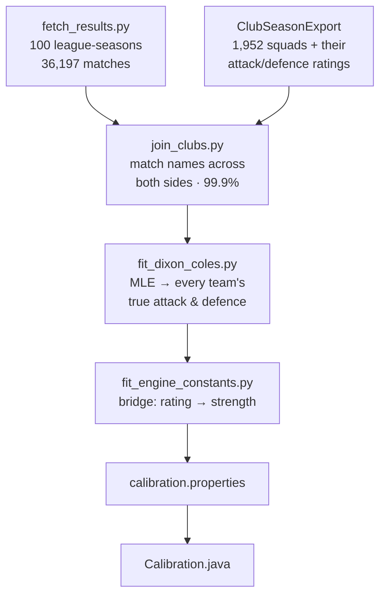
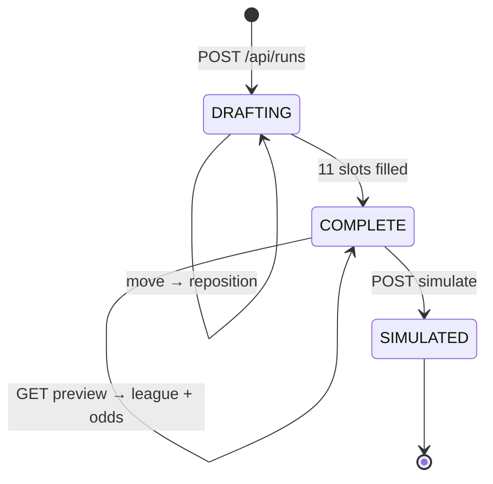

# footy-draft — technical documentation

How the system works, why each piece is shaped the way it is, and what is known to be wrong with it.

This is the deep version. [README.md](README.md) is the tour; this assumes you want the formulas and the reasoning. It's written to be read top to bottom — each section uses what the previous one established.

---

## Contents

1. [What the system has to do](#1-what-the-system-has-to-do)
2. [Data: twenty years of players](#2-data-twenty-years-of-players)
3. [From a squad to two numbers](#3-from-a-squad-to-two-numbers)
4. [The match model](#4-the-match-model)
5. [Calibration: where the constants come from](#5-calibration-where-the-constants-come-from)
6. [What the calibration found](#6-what-the-calibration-found)
7. [Validation: does it reproduce real football?](#7-validation-does-it-reproduce-real-football)
8. [Simulating a season](#8-simulating-a-season)
9. [Projections and odds](#9-projections-and-odds)
10. [The draft state machine](#10-the-draft-state-machine)
11. [Persistence and the API](#11-persistence-and-the-api)
12. [The frontend](#12-the-frontend)
13. [Testing](#13-testing)
14. [Invariants](#14-invariants)
15. [Known limitations](#15-known-limitations)

---

## 1. What the system has to do

The game is: assemble eleven players one at a time from constrained choices, then play a 38-game league season against nineteen real club-seasons.

That imposes four requirements which between them explain most of the design.

**Any eleven players must be rateable.** The user's XI is an arbitrary collection across twenty years and five leagues. There's no historical record of how *that* team performs, so team strength has to be computed from the players alone.

**The same function must rate opponents.** If the user's XI were scored differently from the clubs it plays, the league table would be meaningless. One function, used everywhere.

**Everything must be reproducible.** A season is generated from a seed. Given the same seed you get the same season — necessary for replay, for testing, and for the pre-season projection to agree with what actually happens.

**The projection and the result must come from the same model.** If the game tells you "68 points expected" and then simulates something unrelated, the central drama — did I overperform? — is fake. Both come from the same engine, with the same seed and the same opponents.

### The two-layer structure



Layer 1 says what should happen. Layer 2 is what did. The distance between them, expressed as a percentile, is the debrief's verdict.

---

## 2. Data: twenty years of players

### Sources

Twenty FIFA/EA editions, 2006/07 through 2025/26, assembled from four differently-shaped sources:

| Source | Editions | Notes |
|---|---|---|
| `male_players_all.csv` | FIFA 15–23 | the clean bulk, one row per player-season |
| `fc_24.csv` | 23/24 | league id and name columns are scrambled |
| `fc_25_sofifa.csv` | 24/25 | |
| `EAFC26-Men.csv` | 25/26 | a different schema entirely — `OVR`, not `overall` |
| `Scraped_data_new/fifa_07..14` | FIFA 07–14 | manually scraped |

Result: **~1,952 club-seasons, ~58,000 player-seasons**, filtered to the top five leagues.

`FifaDataLoader` handles the variation rather than requiring one canonical format:

- **Two schemas.** `loadAllSeasons` reads the sofifa layout; `loadModern` reads EA's ratings-export layout. `loadEdition` sniffs which — an `OVR` column means the latter.
- **Column aliases.** `player_id` or `sofifa_id`; `club_name` or `club`; and so on.
- **Top-5 by numeric league id** (13/53/31/19/16) rather than by name, because league names drift with sponsors — "Serie A" became "Serie A TIM" became "Serie A Enilive". Where there's no id column, a name-alias set is the fallback.
- **Tolerant parsing.** `parseIntLoose` reads a leading integer, so `24.0` works and sofifa's form-change suffix `87-1` reads as 87.
- **Position remapping.** `normPos` maps positions with no formation slot: `CF→ST`, `LF→LW`, `RF→RW`, `SW→CB`. Without this a CF-only Messi cannot be fielded at all.
- **Season-level dedup.** An earlier file in the list wins a whole season, so overlapping sources don't double-count.

### Era normalisation

A problem specific to spanning twenty years: **sofifa inflated its ratings across FIFA 15→16→17.** The same player, unchanged in ability, gained a couple of points. Left alone, modern squads dominate the draft for a reason that has nothing to do with football.

Measured from the median drift of players appearing in consecutive editions, the correction is a graduated ramp (`FifaDataLoader.wideTaperOffset`):

| Rating | Lift | Reasoning |
|---|---|---|
| ≤ 84 | +2 | the bulk of the distribution |
| 85–89 | +1 | tapering |
| ≥ 90 | 0 | the elite keep their raw ratings |

Applied in full to FIFA ≤15, at half strength to FIFA 16, and not at all from FIFA 17.

Two deliberate properties. The taper avoids a cliff at the boundary, and because the lift never reaches 90, **prime Messi stays 94** — no cap is needed, and the ceiling is untouched. After correction, old editions produce the top tier at ~1.7% of club-seasons against modern's ~2.6%, which is close enough that cross-era drafting feels fair.

> Six alternative schemes were compared before choosing this one; the comparison is in `analysis/tier-distribution.md`, regenerated by `TierReport`.

**This matters for calibration.** The fitted constants were derived from era-normalised ratings. Change the normalisation and they must be refitted.

---

## 3. From a squad to two numbers

### Picking the best XI

`ClubSeason.optimalXi()` answers: what's the strongest legal eleven this squad can field?

It tries all seven formations and keeps the one with the most players in a **natural position**, breaking ties on overall. Within a formation, `buildXi` solves an **optimal maximum bipartite matching** between players and slots (Kuhn's algorithm, strongest player first).

The matching matters more than it sounds. A greedy fill — walk the slots, take the best available player for each — benches stars whenever forwards compete for slots. If Mbappé, Neymar and Di María can all play LW, greedy assigns one and discards the others even when RW and ST are open. Augmenting paths re-route players already placed, so the algorithm finds an assignment that fields all three. Before this was fixed, elite clubs were being systematically under-rated.

Fallbacks guarantee legality in both directions: a keeper is never fielded outfield, and an outfielder never goes in goal.

Results are cached — `optimalXi()` is called repeatedly while sorting the opponent pyramid.

### Squad → attack and defence

```java
attackRating()  = 0.65·mean(ATT) + 0.35·mean(MID)
defenceRating() = 0.55·mean(DEF) + 0.25·mean(GK) + 0.20·mean(MID)
```

Two numbers per team. That's the entire input to the match model.

**These weights are hand-set, and an attempt to learn them from data failed.** That's worth explaining, because the failure is informative — see [§6](#finding-2-the-line-weights-cannot-be-learned-from-this-data).

---

## 4. The match model

### Poisson, and why it isn't enough

Goals arrive roughly at random at some rate, which makes the Poisson distribution the natural model: pick an expected goals `λ` per side, draw a scoreline.

The engine's `λ`:

```
λ = BASE_GOALS · exp( (attackRating − ATTACK_REF)  / SCALE_ATTACK
                    − (defenceRating − DEFENCE_REF)/ SCALE_DEFENCE
                    + HOME_ADV_LOG   [home side only] )
```

Reading the parts:

- **`BASE_GOALS`** — goals for an average side against an average side. Sets the overall volume.
- **`SCALE_*`** — how many rating points are worth one log-goal. **Larger means gaps matter less**, so raising it compresses the table.
- **`HOME_ADV_LOG`** — home advantage, in log-goals. Multiplies the home rate by `exp(0.258) = 1.29`.
- **`ATTACK_REF` / `DEFENCE_REF`** — the pool's mean ratings. Centring here means the constants are interpretable at an average squad rather than extrapolated to rating zero.

But independent Poisson draws get one thing badly wrong: **too few draws**. Real football produces ~25% draws; independent Poisson gives ~17%. The two scores in a match are correlated — 0–0 and 1–1 happen more than independence predicts, because teams that concede push forward and teams ahead sit back.

### The Dixon-Coles correction

Dixon & Coles (1997) fix exactly this with a correction factor `τ` applied to the four low-scoring cells:

| Score | τ |
|---|---|
| 0–0 | `1 − λμρ` |
| 0–1 | `1 + λρ` |
| 1–0 | `1 + μρ` |
| 1–1 | `1 − ρ` |
| anything else | `1` |

With `ρ < 0` this moves probability out of 1–0 and 0–1 and into 0–0 and 1–1. The joint distribution becomes:

```
P(i,j) = τ(i,j) · Poisson(i; λ) · Poisson(j; μ)
```

`sampleScore` builds the full 13×13 grid, applies `τ`, and draws one cell with a **single uniform random number** — which keeps a season reproducible from its seed.

`ρ` is the draw-rate lever, and it's largely independent of the points spread, which makes it a clean knob. It is now fitted rather than chosen: **−0.0662**.

### Who scores

Once the scoreline exists, goals are attributed to players by weighted sampling:

```
weight(player) = positionWeight(slot) × ratingFactor(overall)
ratingFactor(o) = ((o − 55) / 45)³
```

The cube concentrates goals on the best players — a 90 takes roughly twice the share of an 80.

**This never affects scorelines or points.** Attribution only decides whose name goes on a goal that has already happened, which means `ScoringWeights` can be tuned freely against the leaderboards without touching calibration. A useful separation: the thing that's hard to get right (points) is decoupled from the thing that's easy to eyeball (top scorers).

---

## 5. Calibration: where the constants come from

### The problem with tuning by hand

The engine originally had six constants, each found by changing it, running a simulation, and judging the output. Three problems with that:

1. **Slow** — every iteration is a compile, a run, and a judgement call.
2. **Subjective** — "looks about right" isn't comparable to another "looks about right".
3. **Coupled** — `ρ` and `SCALE` both affect the draw rate. With six interacting knobs you can find *a* configuration that looks fine while never knowing if it's the best one, and two wrong values can cancel out and look healthy.

### Maximum likelihood, plainly

The alternative is to measure them. The tool is **maximum likelihood estimation**, and the idea is simpler than the name.

**Likelihood** asks: given a set of constants, how probable is real football history? Arsenal beat Spurs 3–1 in November 2017. With one set of constants the model assigns that exact scoreline 4% probability; with another, 6%. The second explains this match better. Do that for all 36,197 matches and combine — one number saying how well those constants explain reality.

**Maximum** means: search for the constants that make that number largest.

That's all. `scipy.optimize` does the searching.

> In practice you sum **log** probabilities rather than multiplying raw ones — 36,197 numbers all below 1 underflow to zero long before you finish. And optimisers minimise by convention, so the objective is the *negative log-likelihood*. Same thing, flipped twice.

### The pipeline



Python runs **only offline**. Its single output is a properties file read by Java at startup, so the deployed artifact stays one jar with no Python dependency.

### Step 1 — real results

`football-data.co.uk`, free and keyless, at a predictable URL:

```
https://www.football-data.co.uk/mmz4281/{SEASON}/{LEAGUE}.csv
    SEASON = 0607 … 2526      LEAGUE = E0 SP1 I1 D1 F1
```

100 files, **36,197 matches**, all carrying date, teams, full-time goals, and bookmaker closing odds.

One anomaly worth recording because it looks like corruption and isn't: **Ligue 1 2019/20 has 279 matches, not 380.** France abandoned that season on 8 March 2020 and settled the table on points-per-game, while the other four leagues resumed behind closed doors. The MLE handles a short season natively — those twenty teams simply get wider confidence intervals.

### Step 2 — the join

Both sides must agree on club identity. Both keys already existed:

- **Season** — `FifaDataLoader.seasonFor(edition)` emits `"2017/18"`; football-data files are named by season.
- **Club** — `ClubSeason.normClub()` strips accents and club-type tokens (FC, AC, CF, SS…).

Normalisation alone resolves ~50%. football-data uses short names ("Man United", "Wolves", "M'gladbach") where sofifa uses full ones, so the rest needs `club_aliases.json`, about a hundred entries.

Two wrinkles worth knowing if you extend this:

**Alias values can be lists.** sofifa's own spelling drifts between editions — "FC Köln" in one, "1. FC Köln" in another — and those normalise differently. Each candidate is tried against the season being matched.

**Automated suggestions need review.** `join_clubs.py --suggest` proposes candidates by containment and edit distance. It's useful but it confidently proposed *Real Madrid* for "Ath Madrid", *Paris FC* for "Paris SG", and *AC Ajaccio* for "Ajaccio GFCO" — three different clubs. Every suggestion was checked by hand.

**Final: 1,952 of 1,954 team-seasons, 99.9%.** The two misses are an upstream data gap, not a join failure: FIFA 21's Serie A contains only 18 clubs, omitting Roma (which lost its EA licence that year) and newly-promoted Spezia. Dropped rather than patched.

The join validates itself at the extremes — the highest and lowest points totals it produces are Juventus 2013/14 on 102, Real Madrid 2011/12 and Barcelona 2012/13 and Man City 2017/18 on 100, Derby 2007/08 on 11, Southampton 2024/25 on 12. All real records.

### Step 3 — fitting Dixon-Coles

The model fitted to the results:

```
λ_home = exp(α_home + β_away + γ)
λ_away = exp(α_away + β_home)
P(i,j) = τ(i,j; λ, μ, ρ) · Poisson(i; λ) · Poisson(j; μ)
```

- `α` (attack) and `β` (defence) are fitted **per league-season** — strength belongs to that squad in that year, not to the club forever.
- `γ` (home advantage) and `ρ` are **global**, pooled across all 100 league-seasons. They aren't team-specific, and pooling determines them far better than 380 matches could.

**Identifiability.** `α` and `β` are only defined up to an additive constant: add 1 to every attack and subtract 1 from every defence and the likelihood is unchanged. Without a constraint the optimiser wanders forever. The standard fix, used here, is to impose `Σα = 0` within each league-season.

**The optimiser needed restructuring.** Fitting all 3,810 parameters jointly does not work — scipy's finite-difference gradient costs ~3,810 likelihood evaluations per step, and the fit stalled unconverged after 28 iterations and five and a half minutes.

But given `γ` and `ρ`, **the blocks are independent**: a league-season's `α`/`β` appear in no other block. So the fit is block coordinate descent:

```
repeat until the likelihood stops improving:
    1. hold (γ, ρ) fixed → fit each league-season separately      (100 small problems)
    2. hold every α/β fixed → fit (γ, ρ)                          (2 parameters)
```

Each step is cheap and monotonically decreases the same objective. **Converges in 9 sweeps and 9.7 seconds**, to a *lower* likelihood than the truncated joint attempt — about 33× faster and it actually finishes.

### Step 4 — the bridge

The MLE gives every real team's true strength. The player data gives what the engine *thinks* of the same squad. Regress one on the other and the relationship is the engine's calibration.

```
α  =  (attackRating  − ATTACK_REF ) / SCALE_ATTACK  + a₀
β  = −(defenceRating − DEFENCE_REF) / SCALE_DEFENCE + b₀

BASE_GOALS = exp(a₀ + b₀)
```

Two details that matter:

**Fit against the engine's own functions.** A first pass regressed on the XI's plain `overall`, but `MatchEngine` is fed `attackRating()` and `defenceRating()` — different, weighted quantities. Constants must describe the function they're plugged into. Using the right features moved `SCALE_ATTACK` from 18.75 to 20.05.

**Centre the features.** Regressing on uncentred ratings puts the intercept at rating *zero*, which is meaningless extrapolation — an early pass reported `BASE_GOALS = 0.33`, which would have been visibly wrong in play. Centred on the pool mean, the intercept is the value for an average squad: **1.1007**, against the hand-tuned 1.15.

### Step 5 — into Java

`calibration.properties` on the classpath, read by `Calibration` via plain `java.util.Properties`. No Jackson, no Spring — the engine package must stay framework-free, and the no-Maven compile path has to keep working.

Two safeguards:

- **Fallbacks.** If the file is absent, the old hand-tuned values are used and `Calibration.FITTED` is false. A fresh clone still boots.
- **A model-form guard.** The file declares `model.form=split-scale-v2`; `Calibration` throws if that doesn't match what the engine implements. Loading constants fitted for a different formula would otherwise be silently wrong physics rather than a crash.

---

## 6. What the calibration found

### Every constant, before and after

| Constant | What it controls | Was | Now | Source |
|---|---|---|---|---|
| `BASE_GOALS` | goal volume — expected goals for an average side vs an average side | 1.15 | **1.1007** | fitted |
| `SCALE_ATTACK` | rating points per log-goal, attacking. **Larger = squad quality matters less** | 16.5 *(shared)* | **20.054** | fitted |
| `SCALE_DEFENCE` | the same, defending | 16.5 *(shared)* | **26.599** | fitted |
| `ATTACK_REF` | the `attackRating` the constants are centred on | — | **78.441** | pool mean |
| `DEFENCE_REF` | the `defenceRating` they're centred on | — | **77.957** | pool mean |
| `HOME_ADV` | home advantage. Was rating points applied ±symmetrically; now **log-goals on the home rate only** | 3.95 pts | **0.2579** (×1.29) | fitted |
| `RHO` | Dixon-Coles low-score correction — the draw-rate lever. More negative = more 0-0 and 1-1 | −0.11 | **−0.0662** | fitted |
| `FORM_SIGMA` | season-to-season swing. How far a team drifts from its expected level over a campaign | 0.78 | **3.5201** | fitted |
| `FORM_SIGMA_MULTIPLIER` | how much of that swing the game applies | — | **0.70** | empirical |
| `SCALE_DESHRINK` | how far to restore the spread a conditional-mean fit loses | — | **1.0** (full) | generative choice |
| `MAX_LAMBDA` | ceiling on one side's expected goals — a safety clamp for mismatches the draft can create but a real league never sees | 2.5 | **2.5** | unchanged, chosen |
| `Xi` line weights | which lines feed attack and defence | 0.65/0.35, 0.55/0.25/0.20 | **unchanged** | not learnable, see below |
| `POTS_TEAM_WEIGHT` | how much team success skews Player of the Season | 0.63 | **0.63** | unchanged, flavour |
| `Projection` curve | the stateless-demo points estimate | 3.1·ovr − 189 | **2.35·ovr − 130** | refit to the new engine |

Three of those are worth reading twice:

- **`SCALE` split in two**, because attack and defence turn out to respond to squad quality at different rates.
- **`HOME_ADV` changed shape as well as value.** It used to be a symmetric bonus to the home side and penalty to the away side, which no fit supports. Dixon-Coles multiplies the home rate only, and that's how the constant was estimated.
- **`FORM_SIGMA` looks like a 4.5× increase but isn't comparable**, because the old value was tuned against a different `SCALE`. What matters is the effective spread it produces, which is covered below.

Fit quality: Spearman correlation between fitted strength and actual league points averages **0.944** across the 100 league-seasons.

Four findings needed more than a number.

### Finding 1: attack and defence don't share a sensitivity

Squad rating predicts attacking output substantially better than defensive solidity, and moves it about 1.33× as hard.

| Method | SCALE from attack | SCALE from defence |
|---|---|---|
| Ridge | 18.90 | 26.62 |
| OLS | 18.79 | 26.32 |
| Single feature (collinearity impossible) | 18.75 | 26.71 |

All three agree, so it isn't a regularisation artifact. It matches the established result in football modelling: defending depends more on organisation and coaching than on individual quality. Corrected R² is **0.63 for attack, 0.44 for defence**.

**One shared `SCALE` cannot express this**, which is why the engine now has two. This also changed how home advantage is applied: with two scales, "rating points" is ambiguous, so `γ` is kept in log-goals — and Dixon-Coles applies it to the *home rate only*, not as a symmetric bonus and penalty the way the old engine did.

### Finding 2: the line weights cannot be learned from this data

The goal was to replace `Xi`'s hand-set `0.65/0.35` with fitted values. It failed, and the reason took two attempts to diagnose correctly.

**The first diagnosis was wrong.** It claimed collinearity, citing a condition number of 113 — but that was computed on *uncentred* data, where the figure is dominated by the column means. Centred it's 5.5, and every variance inflation factor is under 6. Collinearity is mild.

The coefficients are in fact precisely estimated:

| Feature | Coefficient | Std err | t |
|---|---|---|---|
| mean ATT | +0.02048 | 0.00209 | 9.8 |
| mean MID | +0.01615 | 0.00253 | 6.4 |
| mean DEF | +0.01633 | 0.00290 | **5.6** |
| mean GK | +0.00027 | 0.00160 | 0.2 |

The real problem is **confounding, not collinearity**. Defence genuinely predicts *attacking* output at t = 5.6 — because good clubs are good everywhere. The regression reports that association correctly. It simply isn't a causal contribution.

And the engine needs causal weights, because **the game builds unbalanced cross-era XIs** — exactly the squads a predictive coefficient extrapolates badly to. An XI of elite defenders behind poor forwards would be credited with attacking output it has no way to produce.

Club fixed effects are the standard fix for confounding, and were tried: they collapse here (R² 0.09), because within-club rating movement is small relative to the noise.

**So the hand-set weights stay.** One clean causal read did survive: goalkeeper rating contributes nothing measurable to attack (t = 0.2) — obviously true, and a sign the fit isn't simply absorbing club quality indiscriminately.

### Finding 3: measurement error was distorting two results

`α` and `β` are each estimated from ~38 matches, so they carry sampling noise. The inverse Hessian puts the median `α` standard error at **0.1423**, against a between-team spread of 0.2886 — **a quarter of the variance we were trying to explain was never explainable.**

This does *not* bias the slopes (measurement error in the target never does, so `SCALE` stands), but it depresses R² and inflates the residual:

| | Raw | Corrected |
|---|---|---|
| Attack R² | 0.476 | **0.633** |
| Defence R² | 0.301 | **0.441** |

`FORM_SIGMA` comes straight out of that residual, so it was badly overstated:

```
4.65   naive residual
3.94   minus the persistent club effect
3.52   minus measurement noise as well
```

### Finding 4: the game needs total spread, not "pure form"

The middle line above deserves explanation. The residual contains a **persistent club effect** (sd 0.116) — Atlético under Simeone systematically out-defending their ratings isn't form, it's a permanently missing feature. Stripping it leaves year-to-year form proper: 2.41 rating points.

But **the game should not use that narrower figure.** A real club has history, so form and permanent quality are genuinely distinguishable across seasons. A drafted XI has no history and plays exactly one season — there is no second season for a persistent component to persist *across*. What matters in-game is that the spread of outcomes matches reality, and that needs the **total unexplained variation: 3.52**.

Using 2.41 made the simulated league visibly flatter than real football.

---

## 7. Validation: does it reproduce real football?

Every check so far is indirect. The Demo sweep confirms the curve is monotonic and the draw rate plausible, but it plays a synthetic XI against a synthetic pyramid — it can show the constants are self-*consistent*, never that they're *right*.

`HistoricalValidation` does the direct test: take the twenty real clubs of a real season, field each one's best XI, simulate, compare.

**Across 7 league-seasons and 138 clubs: correlation +0.79, mean absolute error 8.3 points.** Match-level behaviour is close too — draws 23.6–25.7% against a real 25.5%, goals per game ~2.69 against a real 2.72.


### How the experiment is set up

Worth being precise, because the setup determines how the figure should be read.

For each of the seven targets, `HistoricalValidation` looks up that exact league-season in the player data, fields each club's `optimalXi()`, and simulates **that** twenty-team league 200 times. Real points come from `joined.csv`, which is the actual final table built from football-data results. So both sides describe the same twenty clubs in the same season — Juventus's 102 is their real Serie A 2013/14 total, and the simulated figure comes from a league containing the same nineteen opponents they actually faced.

Two different quantities come out of those 200 runs, and they answer different questions:

| Quantity | What it answers |
|---|---|
| **mean points** | what this squad typically achieves — used for MAE and correlation |
| **p10–p90 range** | what seasons the engine actually produces — used for coverage |

### The compression, and how to read it correctly

Plotted as means, champions look systematically under-predicted: Juventus's 102 against a simulated 70, Derby's 11 against 37.

**Most of that is an artifact of comparing an average to a single draw.** The real table is one realisation, including whatever luck that season contained; the mean of 200 simulations is an expectation. An expectation is less extreme than a draw by construction, so plotting one against the other manufactures apparent under-prediction even for a perfect model.

The coverage figure is the fair test: **93% of real results fall inside the simulated p10–p90 range**, record seasons included. The engine does produce 90-point champions — it just doesn't *average* to them, and neither does real football.

Two genuine effects remain once that's accounted for:

- **The conditional means are compressed.** A predictor explaining R² of the variance produces predictions with √R² of the spread, always. At R² = 0.63 that's 0.79×.
- **The ranges are slightly too wide.** 93% coverage against an ideal 80% means the per-team spread is over-dispersed.

These point in opposite directions and largely cancel in the league table, which is why the table *shape* matches (spread sd 17.1 against a real 16.9) while both components are individually off. Stated plainly: **the engine is a little under-confident about which team is better, and a little over-random within a season.**

That cancellation is a consequence of how `FORM_SIGMA` was calibrated — tuned so total table spread matches reality, which necessarily inflates the noise term to compensate for a compressed systematic term.

### De-shrinking: fixing both errors instead of cancelling them

The cancellation above was unsatisfying, and it showed up in play as teams swinging further from their expected finish than felt right. It's measurable:

| | before |
|---|---|
| Simulated per-team spread | 14.69 pts |
| Actual deviation of real results from prediction | 11.21 pts |

The second figure contains *both* model error and real season noise, so our noise alone being 1.31× the total meant the per-team distribution was clearly too wide.

**The fix isn't to turn `FORM_SIGMA` down — it's to stop compressing the signal in the first place.**

A regression predicts the conditional mean, so its predictions carry √R² of the true spread. That's correct for forecasting one team and wrong for generating a league. Multiplying the scale by √R² restores the lost spread (a smaller scale means rating differences matter more):

| | fitted | × √R² | old hand-tuned |
|---|---|---|---|
| attack | 20.054 | **15.91** | 16.5 |
| defence | 26.599 | **17.62** | 16.5 |

Both land either side of **16.5**, the value originally reached by hand — which makes sense, because hand-tuning was judged on whether the *league* looked right, the generative objective, not the predictive one.

This lives in `GameBalance.SCALE_DESHRINK` (0 = as measured, 1 = full correction) rather than in the calibration file, because it's a deliberate choice about what the model is *for*, not a measurement.

### What it bought

Expected a trade-off; got an improvement on every axis. Measured across the same 7 real league-seasons:

| | deshrink 0 / mult 1.40 | **deshrink 1 / mult 0.70** | real |
|---|---|---|---|
| Per-team spread | 14.72 | **11.35** | under 10.25 |
| Error vs real results | 11.14 | **10.25** | lower is better |
| League table spread | 17.0 | **16.9** | 16.9 |
| Coverage | 93% | **88%** | 80% ideal |
| MAE | 8.5 | **8.2** | |
| Champion points | 76–88 | **84–91** | 81–102 |

Prediction accuracy *improved* rather than degrading, because getting the systematic spread right matters more at the extremes than the cost of over-committing.

`FORM_SIGMA`'s multiplier drops from 1.40 to 0.70 as a direct consequence: with the signal no longer compressed, the noise term no longer has to be inflated to hide it. Both components are now roughly right individually, instead of wrong in cancelling directions.

### What it costs: fewer Leicesters

The one real casualty. A team finishing 25+ points above its own expected total:

| | frequency |
|---|---|
| deshrink 0 / mult 1.40 | 4.51% of team-seasons |
| **deshrink 1 / mult 0.70** | **1.40%** |

Roughly three times rarer — about one such season every three or four league-years rather than one most seasons. Leicester 2015/16 remains reachable but is now genuinely exceptional, which is closer to how often football produces one.

Worth being honest about the limit here: the model has no way to represent "this squad is better than its ratings suggest", so the only route to a Leicester is noise. Leicester's real 81 sits far outside their simulated 27–57 range either way — the engine never really explains that season, it can only occasionally stumble into it.

### Measured versus chosen

Which raises a design question worth being explicit about. Two legitimate goals pull in opposite directions: **realism** wants the simulation to reproduce football, **playability** wants a good draft to be visible in the final table rather than drowned in noise.

Overloading one number with both jobs means quietly falsifying a measurement, after which nobody can tell which constants are evidence and which are taste. So they're separated:

| File | Class | Rule |
|---|---|---|
| `calibration.properties` | `Calibration` | measured; **never** hand-edited; regenerated by the pipeline |
| `game-balance.properties` | `GameBalance` | chosen; hand-edited freely; every value carries a written reason |

This makes the honest statement available: *"real football has FORM_SIGMA ≈ 3.52; below a 1.40 multiplier the game is deliberately calmer than reality so draft quality stays legible."*

---

## 8. Simulating a season

`SeasonSimulator` plays a full 38-matchday campaign for 20 teams.

**Fixtures** come from the circle method: a single round-robin of 19 matchdays, then mirrored with home and away swapped. 380 fixtures, each ordered pair exactly once, every team playing once per matchday, home and away alternating for spacing. Deterministic, no RNG.

**Season form.** Each team draws one mean-zero Gaussian at the start (`σ = FORM_SIGMA`), applied to both attack and defence for the whole season. Mean-zero keeps the long-run average and the projection intact while making any single campaign swing — which is where genuine over- and under-performance comes from.

**Statistics are keyed per (team, player)**, never globally by player id. The same real player can appear on two different club-seasons in the same league, and they are two separate competitors.

Tracked across the season: the full table, every player's goals/assists/clean sheets, a **match log** with scorers and minutes, and a **table snapshot after every matchday** — which is what makes matchday-by-matchday playback possible.

**Awards.** Golden Boot, Playmaker, Golden Glove (filtered to keepers — clean sheets are credited to the whole backline, so an unfiltered ranking would be topped by centre-backs), and Player of the Season, which weights raw contribution by where the team finished:

```
score = (goals·4 + assists·3 + cleanSheets·2) × (1 + 0.63 · (N − position)/(N − 1))
```

Mirroring the real award's bias toward winning teams — a relegation hero must vastly outproduce a champion's star to win it.

---

## 9. Projections and odds

The projection is not a formula. `MonteCarlo.run` **simulates the user's exact season 1,000 times** — same XI, same nineteen opponents, same engine — using `fastScore`, a scoreline-only path with no attribution. It completes in under a second.

Because every simulation already tallies every team's points, one run yields a full distribution for **every** team at no extra cost:

- mean points and projected finish
- quantiles (p5 / p25 / median / p75 / p95) and a histogram
- genuine odds: title, top four, top six, relegation, unbeaten, and the perfect 38–0
- the sorted points array, kept server-side, so the debrief can place a team's actual season as a **percentile** within its own distribution

That percentile is the debrief's verdict: ≥70 is overperformance, ≤30 is under.

**Why it matters that this is the same engine.** Preview and debrief use identical opponents and seed, so they agree exactly — pinned by a test. And because the projection *is* the simulation, it tracks the engine automatically: no refitting when constants move.

The older fitted curve (`Projection`, now `2.35·overall − 130`) survives only as the stateless demo fallback.

---

## 10. The draft state machine

`DraftRunService` owns the flow. Server-authoritative, seeded, fully replayable.



### Tier-first spinning

A spin picks a **tier** first, then offers clubs from it — not the other way round:

| Tier | Strength | Landing weight |
|---|---|---|
| ICONIC | 87–99 | 6 |
| ELITE | 83–86 | 18 |
| PEDIGREE | 78–82 | 42 |
| STEADY | 72–77 | 25 |
| MINNOW | 58–71 | 9 |

Sampling clubs uniformly would be overwhelmingly Steady, because that's where most club-seasons sit. Weighting the *tier* makes the squad ceiling a tunable design parameter rather than an accident of the data distribution. Iconic stays a rare jackpot.

Having landed on a tier, up to three distinct clubs are offered, excluding any club already drafted from and any squad that can't fill an open slot. If a tier has nothing usable it's removed and another is drawn.

All randomness derives from `run.seed` plus a per-spin counter, so the whole draft replays identically.

### Scout ratings

With `ShowRatings.SCOUT`, the true overall **never reaches the client**. `ScoutRatings` derives a band deterministically from `(sofifaId, runSeed)`, and the band is **asymmetric** — otherwise averaging the endpoints would recover the true value. Drafted players are revealed on your own pitch.

### Known quirk

Opponents are built from the full club pool, so they ignore the run's era and scope filters — your *draft* respects "Modern '16+" but your *opponents* can come from any era. This is deliberate for now (draft clubs never block league clubs), and both `preview()` and `simulate()` go through a single seam, `opponentsFor(run, rng)`, so changing it is a one-line edit that keeps projection and result consistent automatically.

---

## 11. Persistence and the API

**JPA over H2**, in-memory. `ClubSeasonEntity` ↔ `PlayerEntity` with positions in an ordered join table; `DraftRunEntity` ↔ `DraftSlotEntity` for run state. `DataSeeder` loads the CSVs into H2 at startup; `GameCatalog` reads them back once via a fetch-join and caches the engine objects.

`EngineMapper` converts entity ↔ engine record in both directions, which keeps JPA annotations out of the pure engine package.

> The store is `mem:`, so **runs do not survive a restart**. Making it durable is the next persistence task.

### Endpoints

| Method | Path | Purpose |
|---|---|---|
| `GET` | `/api/season/demo` | stateless demo season (`&prime=true` for career-best) |
| `POST` | `/api/runs` | create a run |
| `POST` | `/api/runs/{id}/spin` | land a tier, offer clubs |
| `POST` | `/api/runs/{id}/draft` | place a player |
| `POST` | `/api/runs/{id}/move` | reposition |
| `GET` | `/api/runs/{id}/preview` | opponents + Monte-Carlo projection |
| `POST` | `/api/runs/{id}/simulate` | play the season → replay + debrief |
| `GET` | `/api/explore/meta`, `/clubs`, `/squad` | the Almanac |

---

## 12. The frontend

React + Vite + TypeScript + Tailwind v4 + Framer Motion, themed as an editorial yearbook — Fraunces and Inter, a warm-ink palette, one ochre accent, all tokenised in `src/index.css`.

A view machine drives `setup → draft → playback → results`, plus `explore`, with page-turn transitions between screens.

Pieces worth knowing about:

- **`SpinReveal`** — suspense scaled to the tier that landed, so an Iconic spin feels different from a Minnow.
- **`ScoutRating`** — renders a Scout band as a smudged-ink confidence interval rather than a number.
- **`ForecastCone`** — the Monte-Carlo distribution as a fan, with the actual season pinned inside it.
- **`SeasonSpine`** — the season as a ribbon of W/D/L blocks, an unbeaten run drawn as a gold thread that frays at the loss.
- **`predictions.ts`** — detects narrative moments in the replay (summit clash, unbeaten run on the line, banana skin, final-day decider) and pauses playback to ask you to call it. Entirely client-side and deterministic: the result is already fixed by the sim.

---

## 13. Testing

`mvn test` — 35 tests.

| Area | What's checked |
|---|---|
| Determinism | same seed ⇒ identical season |
| Calibration | monotonic curve, draw rate and goals in band, fitted constants loaded, model form matches |
| Match model | `τ` boosts only the four low-score cells; home advantage lifts the home rate only |
| Fixtures | 38 matchdays, 380 games, each ordered pair once, every team once per matchday |
| Data | edition span, canonical leagues, Prime index correctness and no-op on single-edition data |
| Draft flow | natural positions enforced, rerolls, Scout leaks nothing, preview and debrief agree |

Two things beyond unit tests:

- **`HistoricalValidation`** — the real acceptance test ([§7](#7-validation-does-it-reproduce-real-football)).
- **`scripts/smoke_test.py`** — plays a complete run against a live server and checks every step. Standard library only.

---

## 14. Invariants

Break these and something subtle goes wrong elsewhere.

1. **One strength function.** Club-season → `optimalStrength()`. User XI, opponents, everything. No bespoke per-opponent ratings.
2. **Seeded RNG threaded everywhere.** Same seed ⇒ identical result.
3. **Stats keyed per (team, player)**, never globally by player id.
4. **Natural positions for placement.** Fallbacks never field a keeper outfield or an outfielder in goal.
5. **Two layers stay separate.** Projection and actual season, both from the same engine and seed.
6. **Opponents are rated as their own sampled season**, independent of the user's Prime toggle.
7. **Measured and chosen constants stay in separate files.** `calibration.properties` is never hand-edited.
8. **Calibration is conditional on `Xi`'s line weights.** Change those and the constants must be refitted.

---

## 15. Known limitations

Stated plainly, because most of them are informative.

**The model explains 63% of attacking strength and 44% of defensive strength.** Squad ratings don't capture coaching, injuries, transfers, or luck. This is near the ceiling for rating-only features, and it's why the simulation under-predicts record seasons.

**`optimalXi()` is optimistic.** It fields the best XI a squad *could*, not the one that actually played. Real teams rotate and get injured, so the features systematically overstate. The regression absorbs this into its slope, but it's a real bias.

**Per-line weights are hand-set** and cannot be learned from observational data ([§6](#finding-2-the-line-weights-cannot-be-learned-from-this-data)).

**Home advantage is a single global constant**, but it measurably declined over the twenty seasons and collapsed in 2020/21. The fit averages over that trend.

**Era normalisation is coupled to the calibration.** Change `wideTaperOffset` and the constants must be refitted.

**Opponents ignore the run's era and scope filters** ([§10](#known-quirk)).

**FIFA 07–10 players have only one position each** — a scraping gap, not a fact about football. It makes ~20% of the pool harder to field and, in four of seven formations, undraftable. Written up with candidate fixes in [docs/KNOWN_ISSUES.md](docs/KNOWN_ISSUES.md).

**Runs are in-memory** and vanish on restart.

### What would move the needle

Roughly in order of expected value:

- **One-stage estimation.** Fit the engine's parameters directly to match results instead of going via per-team strengths and a bridge regression. No information lost between stages, correct uncertainty, and every added parameter becomes testable by likelihood ratio. Around 10 parameters instead of 3,810 — seconds to run.
- **Held-out evaluation against bookmaker odds.** The closing odds are already in the downloaded files. Walk forward by season, score with log loss and RPS, and refuse any parameter that doesn't improve out-of-sample. This is the discipline that separates modelling from curve-fitting.
- **Wage bill as a feature.** Wage spend is the strongest known predictor of league position, and `wage_eur` is ~99% populated for FIFA 15–23. It would also be a legitimate game mechanic — a drafted XI has a wage bill too.
- **A per-era offset term**, which would directly test whether `wideTaperOffset` was the right call.
- **Cross-era chemistry**, which is the change that makes the draft a decision rather than a filter.
